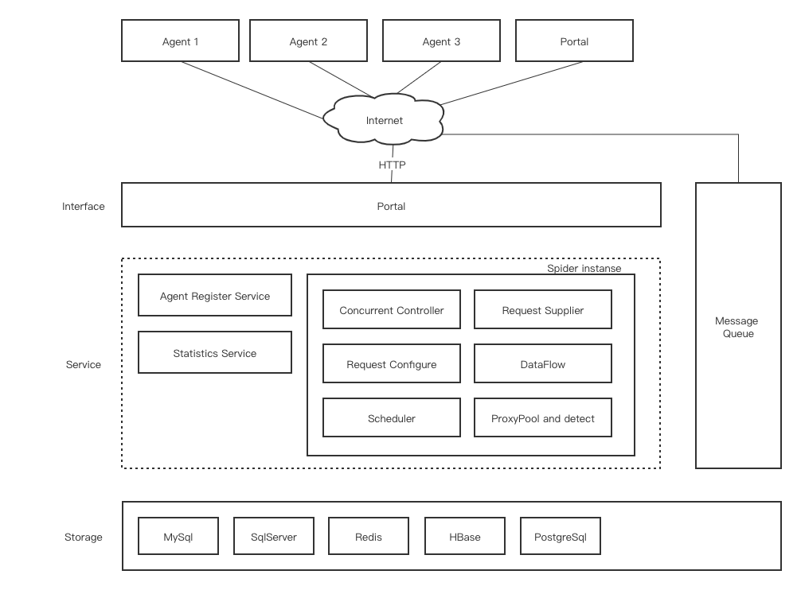

# 概述
ResourceSpider 是一个轻量、灵活、高性能、跨平台的分布式网络爬虫框架，可以帮助 .NET 工程师快速的完成资源爬虫的开发。

# 技术栈与架构要求

1. 如下设计图，整个爬虫设计是纯异步的，利用消息队列进行各个组件的解耦，若是只需要单机爬虫则不需要做任何额外的配置，默认使用了一个内存型的消息队列；若是想要实一个纯分布式爬虫，则需要引入一个消息队列即可.要求项目结果严格按照图片设计图进行实现，不能有任何偏差。

2. 爬虫系统整体分为Agent和服务端，Agent负责下载数据，服务端负责协调和管理多个Agent。当Agent没有连接到服务端的时候，则会默认读取本地的采集任务并将结果存放到本地中；若是连接到了服务端，则会将采集任务发送到服务端，服务端会根据任务的类型和优先级进行调度，并从服务端请求新的采集任务以更新自己的任务列表，如果完成采集任务，则进入等待状态。
3. 服务端负责任务的调度、分发、监控和管理。基于ASP.NET Core 11.0框架实现，提供RESTful API接口。服务端会监听指定的端口，接收来自Agent的请求，根据请求内容进行任务调度、分发、监控和管理。需要在服务端实现上图的Interface层、Service层和存储层。
4. 整体项目可以参考https://github.com/dotnetcore/DotnetSpider 去开发，根据需要修改和扩展，但不要直接引用该项目和该项目的Nuget包
5. 数据访问：使用SqlSugar.Core库作为ORM框架，任务的存储建议可以缓存到Redis中，避免数据库压力过高，提高系统响应速度。
6. 数据库选择：采用MySQL作为数据库解决方案（考虑到与.NET生态的兼容性及部署便捷性）
7. 部署方式：支持Docker容器化部署，需提供完整的Dockerfile及docker-compose配置文件
8. 其他要求：要求网站现代化、简约素净、功能齐全、响应式设计（适配移动端和PC端）、且符合中国网络规范（6.1.1.1-6.1.1.255）

# 模块介绍
爬虫的基本流程是：下载数据（发送 HTTP 请求并获得返回的 resonse) -> 解析返回的文本（可以是 text、json、html) -> 存储解析到的数据，针对这三个主逻辑，我们可以再细下成以下模块。

- Scheduler 调度器：用于对采集请求的去重、采集顺序控制，默认实现了广度优先和深度优先两种调度器。调度器可以采用不同的 Hash 去重器，通常使用默认的 HashSetDuplicateRemover 即可，若是采集量很大可以使用 BloomFilterDuplicateRemover。若想要调度海量的请求或者有重启续跑这样的需求，则需要自行实现基于数据库（关系型数据库、Redis 等）的调度器。
- DownloadAgent 下载代理器：下载代理器：下载代理器可以部署在不同的机器上，若是单机爬虫则是每个爬虫实例会启动一个单独的下载代理器。下载代理器负责接收需要下载的请求并使用对应的下载器（HttpClient, Puppter 或者自定义实现的下载器）。
- DownloadAgentRegisterService 下载代理器注册服务：此服务仅用于接收下载代理器的注册、心跳，即便不启用起服务也并不会影响爬虫的使用。单机爬虫会默认启用一个内存型的注册服务。
- StatisticsService 统计服务：统计各个爬虫和下载代理器的运行状态，如爬虫总的请求数、成功的请求数等，下载代理器总的成功请求数、总的消耗时间等
- RequestSupplier 请求供应接口：在很多场景下可能下载请求是可以提前知道或存在某个地方（可以是文件、数据库）
- RequestConfig 请求配置 （Spider.ConfigureRequest）：一般情况下请求都可以自动构建好，但在某些特别情况下如加 sign 等，可以统一处理。
- DataFlow 数据流： 数据流分两种，解析器和存储器。最极端情况是你不想搞那么复杂，解析和存储都自己在一个 DataFlow 中实现。一个爬虫可以有多个 DataFlow，执行顺序按添加顺序，在任意一个 DataFlow 中抛出异常都会中断整个处理流程。
- ProxyPool 代理池：每个爬虫实例会启动一个代理后台服务，此后台服务定时从注册的 IProxySupplier 中获取新的代理，每个获得的新代理需要经过检测成功才会入到代理池。在配置文件中或者 Builder 创建时可以配置测试地址：ProxyTestUri
- ConcurrentController 并发控制器：并发控制器以一定速度从 Scheduler 中获取请求并推到到消息队列中，这些请求会缓存在 RequestedQueue 中，这个队列是使用低开销的 HashedWheelTimer 实现的，若在一定时间内未收到下载代理器返回的消息，则认为是 Timeout 触发重试直到超过重试次数限制。

# 开发与部署要求

1. 代码规范：遵循.NET开发最佳实践，代码需有完善的注释
2. 安全性：实现防SQL注入、XSS攻击等安全措施，敏感数据需加密存储
3. 性能优化：确保页面加载速度快，数据查询高效
4. Docker部署：
   - 提供Dockerfile文件，包含完整的构建和运行环境配置
   - 创建docker-compose.yml文件，支持一键部署应用和数据库
   - 配置数据持久化方案，确保容器重启后数据不丢失

# 交付物

1. 完整的源代码（包含Agent和服务端，添加详细的注释和文档，注释要求添加到方法、类、接口等关键位置，确保代码的可读性和可维护性。）
2. 数据库初始化脚本（包含表结构和初始数据）
3. Docker相关配置文件（Dockerfile、docker-compose.yml等）
4. 系统部署文档和使用手册（包括README文件）

项目开发需确保代码可维护性和扩展性，便于未来功能升级和内容更新。
