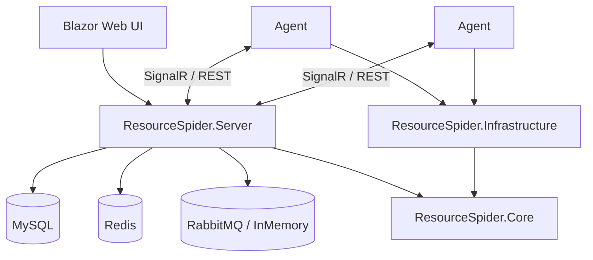

# ResourceSpider 开发说明

面向二次开发与维护者。用户向操作见 [用户使用说明](用户使用说明.md)；仓库入口见 [README](../README.md)。

## 项目目标与范围

ResourceSpider 是轻量、跨平台的分布式网络爬虫框架，采用 Agent–Server 架构：

- **服务端**：ASP.NET Core API + Blazor 管理界面、任务/表达式/代理/统计、SignalR 实时通信
- **Agent**：本地模式（任务文件）或在线模式（连接服务端）执行采集
- **基础设施**：下载器、解析器、调度器、去重、代理池、存储、消息队列等

规模定位偏小型分布式（数十台 Agent 量级）。产品需求细节见 [需求文档（整合版）](分布式爬虫系统需求文档（整合版）.md)。

## 解决方案结构

```text
ResourceSpider/
├── src/
│   ├── Directory.Build.props
│   ├── ResourceSpider.Core/                 # 接口、模型、枚举、常量、异常
│   ├── ResourceSpider.Infrastructure/       # 下载/解析/调度/去重/存储等实现
│   ├── ResourceSpider.Server/               # API + Blazor + Hub + 仓储/服务
│   ├── ResourceSpider.Agent/                # 采集节点
│   ├── ResourceSpider.Tests.Unit/
│   └── ResourceSpider.Tests.Integration/
├── docs/                                    # 文档
├── scripts/                                 # 运维/工具脚本
├── Models/                                  # 模型文件（大文件默认不入库）
├── mysql/                                   # 数据库初始化脚本
├── deploy/                                  # Docker / Compose
├── Doc/                                     # 旧路径跳转
├── sql/                                     # 旧路径跳转
├── ResourceSpider.sln
├── README.md
└── LICENSE
```



工程依赖关系：`Agent` / `Server` → `Infrastructure` → `Core`；测试工程引用对应被测工程。

## 默认命名空间

根前缀必须为：

```text
Larpx.PersonalTools.ResourceSpider.*
```

由 `src/Directory.Build.props` 统一：

```xml
<RootNamespace>Larpx.PersonalTools.$(MSBuildProjectName)</RootNamespace>
```

示例：`Larpx.PersonalTools.ResourceSpider.Core`、`Larpx.PersonalTools.ResourceSpider.Server`。

## 环境 / 构建 / 运行

### 环境

- .NET 10 SDK
- MySQL 8.0+
- 可选：Redis、RabbitMQ、Docker

### 构建

```bash
dotnet restore ResourceSpider.sln
dotnet build ResourceSpider.sln
```

### 数据库初始化

```bash
mysql -u root -p < mysql/init.sql
```

### 运行服务端

```bash
dotnet run --project src/ResourceSpider.Server
```

默认：`http://localhost:5000`（Web UI / Swagger `/swagger` / 健康检查 `/health`）。

### 运行 Agent

```bash
dotnet run --project src/ResourceSpider.Agent
```

- **Local**：扫描本地任务目录，结果写到本地
- **Online**：连接服务端拉取任务并回报

### Docker

```bash
cd deploy
docker compose up -d
```

Compose 中 MySQL 初始化脚本挂载为 `../mysql/init.sql`。

## 配置要点与护栏

- 服务端：连接串、JWT、消息队列类型、下载器与 Playwright 等（见各工程 `appsettings*.json`）
- Agent：`Agent:Mode`（Local / Online）、本地任务路径、服务端地址与节点标识
- **不要**把真实密钥、生产连接串提交进仓库；本地机密用用户机密或环境变量覆盖
- 敏感配置优先环境变量，例如 `ConnectionStrings__DefaultConnection`、`Jwt__Secret`、`Agent__Mode`

## UI 与扩展入口

| 区域 | 位置（示意） | 用途 |
|------|----------------|------|
| Blazor 页面 | `src/ResourceSpider.Server/Components/Pages` | 管理界面 |
| API 控制器 | `src/ResourceSpider.Server/Controllers` | REST |
| SignalR | `src/ResourceSpider.Server/Hubs` | Agent / 管理端实时通道 |
| 业务服务 | `src/ResourceSpider.Server/Services` | 任务调度、注册、存储策略等 |
| 爬虫基类 / 构建器 | `src/ResourceSpider.Infrastructure/Spider` | 自定义 Spider |
| 下载器 / 解析器 / 存储 | `Infrastructure` 对应目录 | 扩展采集与落库能力 |

扩展建议：优先实现 Core 接口，再在 Infrastructure 注册；避免在 UI 层直接耦合底层细节。

## 测试与覆盖约定

```bash
dotnet test ResourceSpider.sln
dotnet test src/ResourceSpider.Tests.Unit
dotnet test src/ResourceSpider.Tests.Integration
```

- 单元测试：纯逻辑、解析、工具等
- 集成测试：跨组件 / 需外部环境时按项目约定准备依赖
- 新增公共行为时同步补测试；宣称完成前应能通过约定的 `dotnet test` / `dotnet build`

## 整改 / 演进脉络（摘要）

| 阶段 | 摘要 |
|------|------|
| 基线 | Agent–Server、多下载器、表达式与多步骤任务、Blazor 管理端 |
| 能力补强 | CDP 下载器、任务步骤断点续传等 |
| 仓库规范整理 | 目录骨架（`docs` / `mysql` / `scripts` / `Models`）、命名空间统一为 `Larpx.PersonalTools.*`、文档拆分、双远端约定 |

更完整的产品与接口背景见需求文档整合版。

## 目录约定

| 目录 | 放什么 |
|------|--------|
| `src/` | 全部业务与测试工程 |
| `docs/` | Markdown 文档与文档配图 |
| `scripts/` | 运维与工具脚本 |
| `Models/` | ONNX 等模型（大文件默认忽略） |
| `mysql/` | 数据库初始化脚本 |
| `deploy/` | Docker / Compose |
| `Doc/`、`sql/` | 旧路径跳转，避免外链失效 |

## 开发侧 FAQ

| 问题 | 建议 |
|------|------|
| 命名空间对不上 | 确认已按 `Larpx.PersonalTools.ResourceSpider.*`，并还原/重建 |
| Compose 找不到 init.sql | 确认从 `deploy/` 启动，且挂载为 `../mysql/init.sql` |
| 旧文档链接失效 | `Doc/`、`sql/` 下有跳转页；正式文档在 `docs/`、`mysql/` |
| 本地工具目录被提交 | `.codegraph/`、`.github/`、`.trae/` 等已 ignore，勿强制 add |

## 文档索引

| 文档 | 职责 |
|------|------|
| [README](../README.md) | 仓库入口 |
| [用户使用说明](用户使用说明.md) | 非技术使用 |
| [开发说明](开发说明.md) | 本文 |
| [需求文档（整合版）](分布式爬虫系统需求文档（整合版）.md) | 需求与设计背景 |
| [README.en.md](../README.en.md) | 英文精简入口 |
